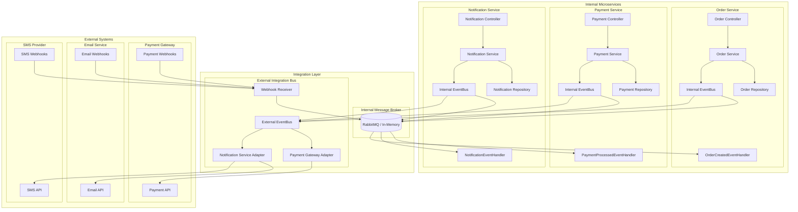
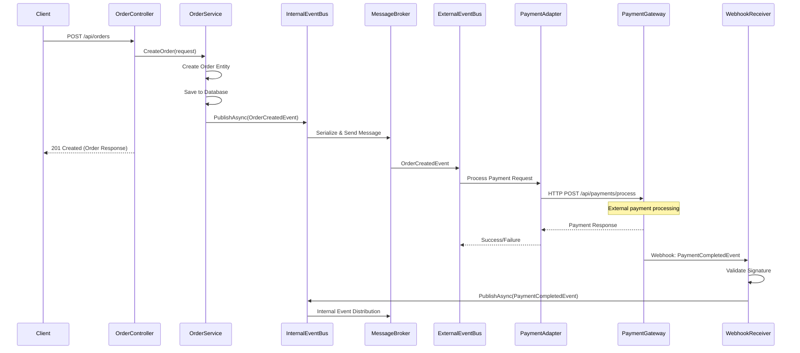
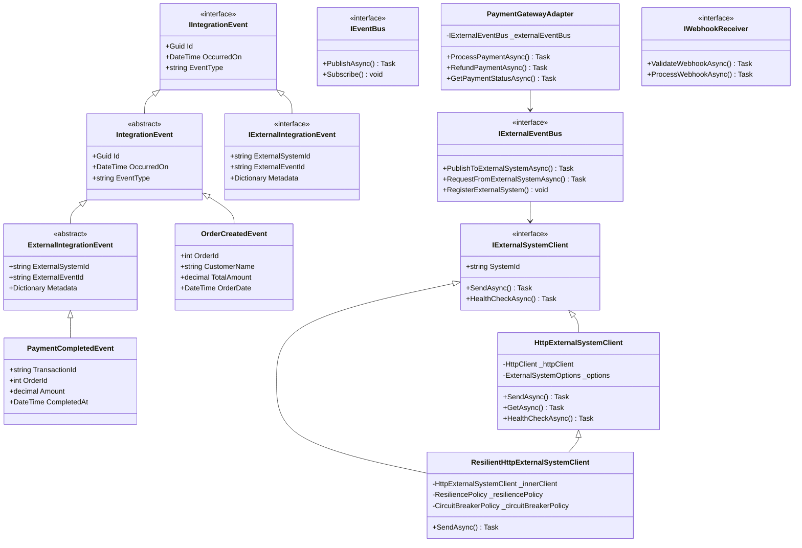
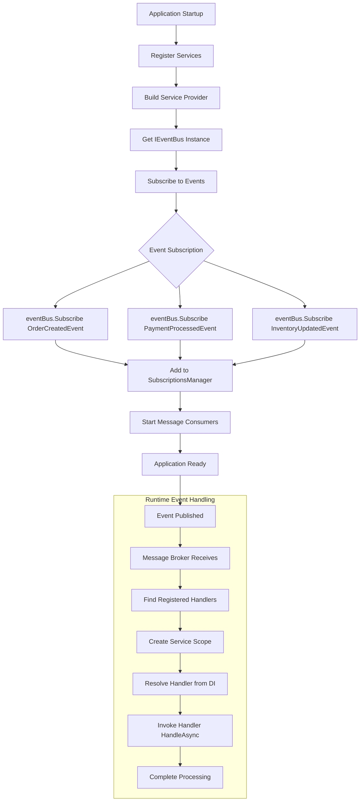
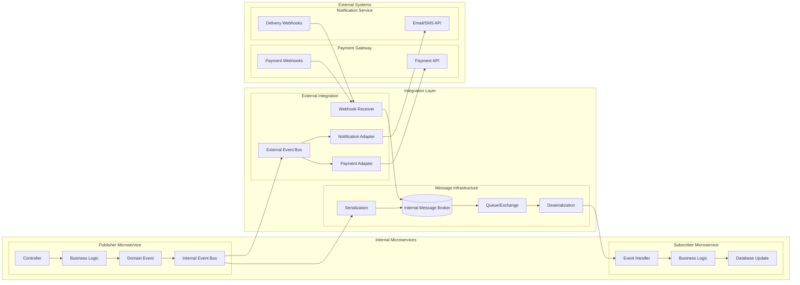
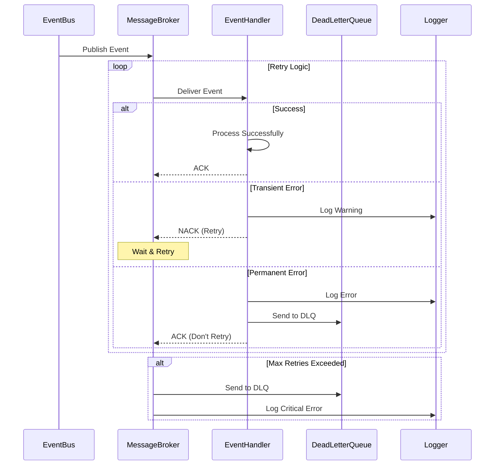
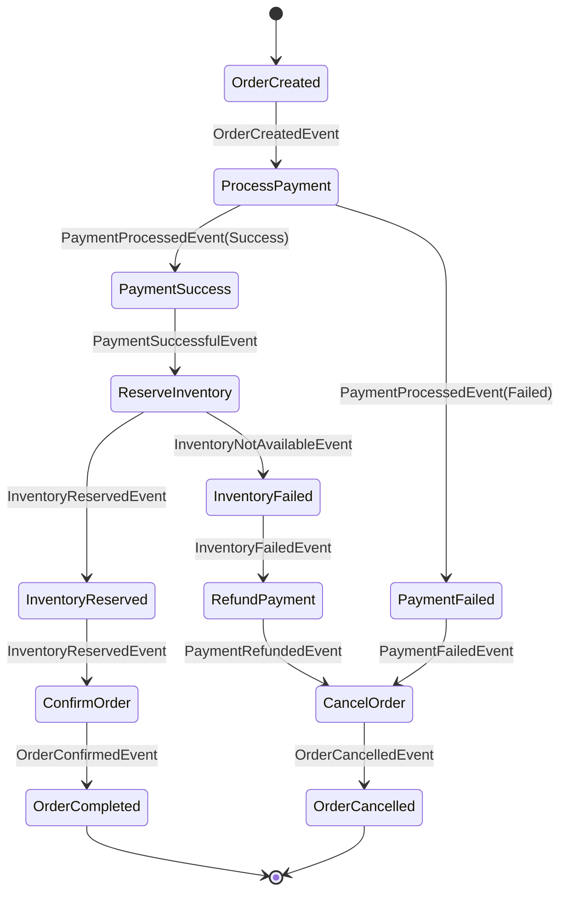
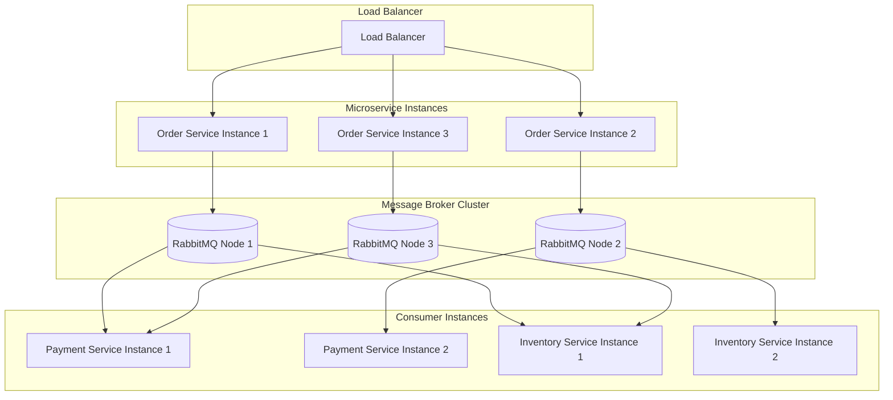
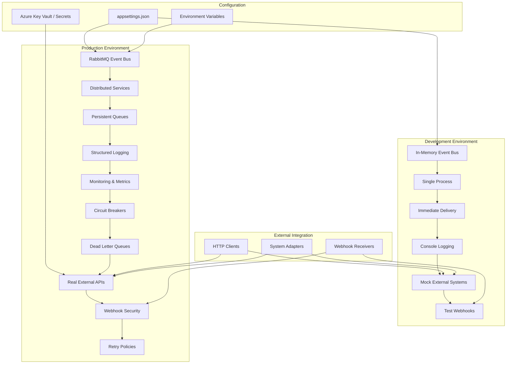
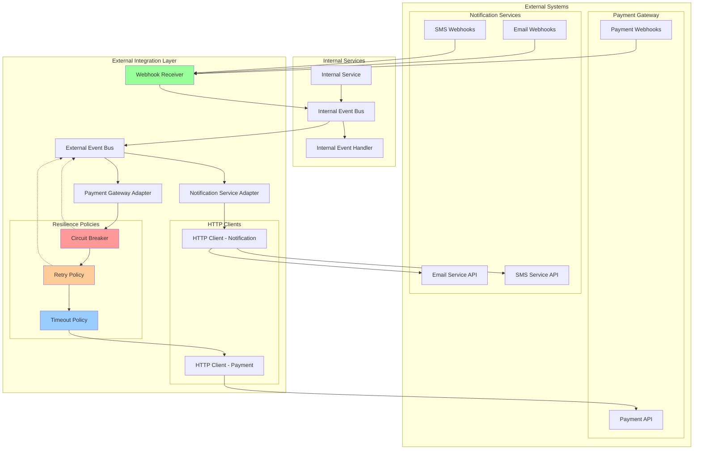

# Integration Bus Architecture Flow

## Overall System Architecture with External Integration

## Event Publishing Flow with External Integration

## Class Hierarchy & Dependencies with External Integration

## Event Subscription & Handling Flow

## Dependency Injection Container Flow

## Message Flow Architecture with External Integration

## Error Handling & Resilience Flow

## Saga Pattern Implementation Flow

## Performance & Scalability Flow

## Development vs Production Flow with External Integration

## External System Integration Flow with Resilience

