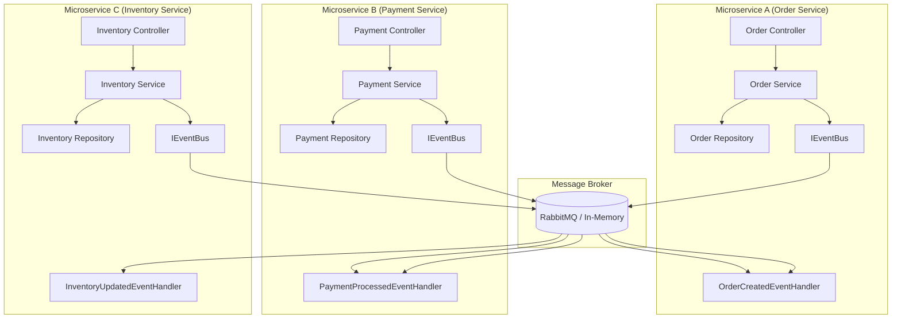
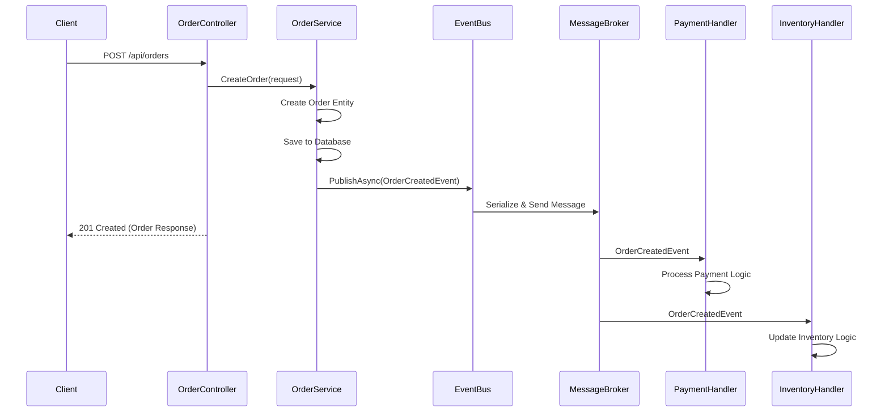
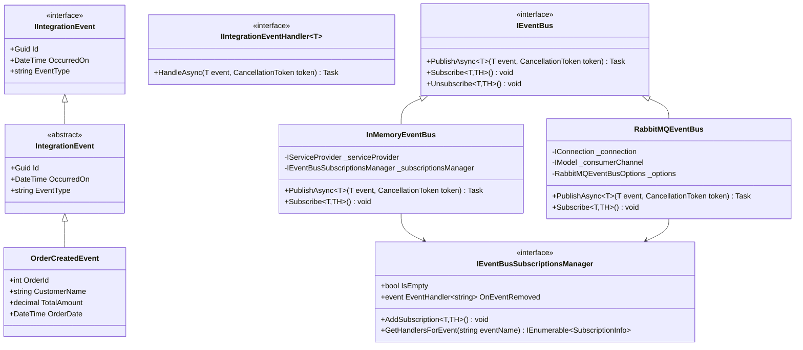
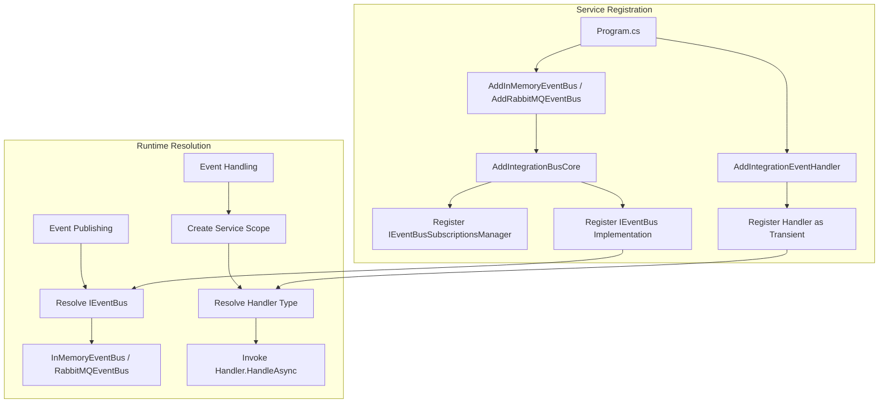
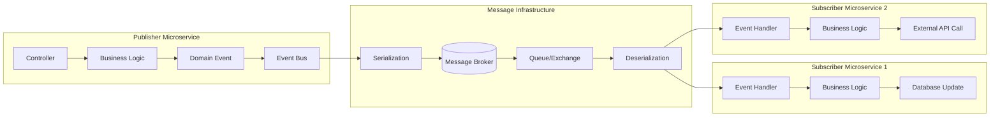
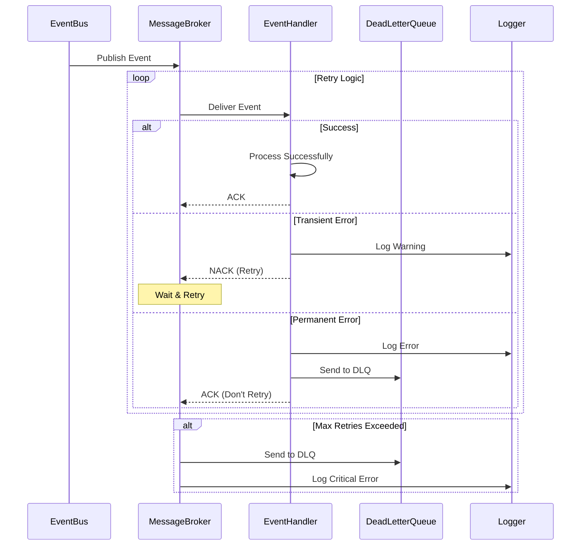
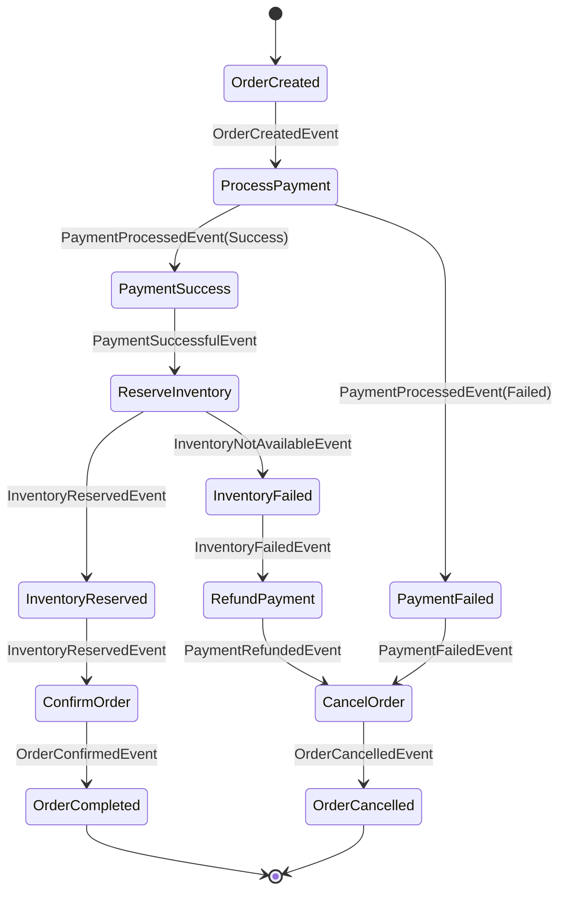
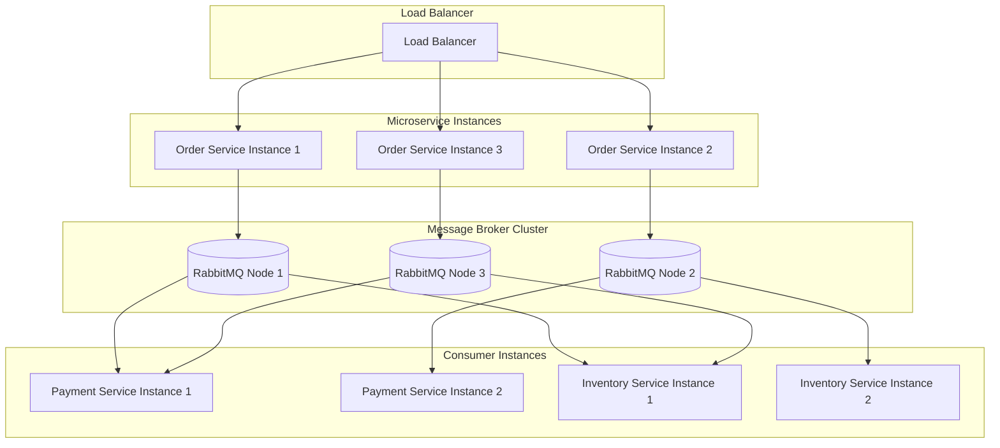
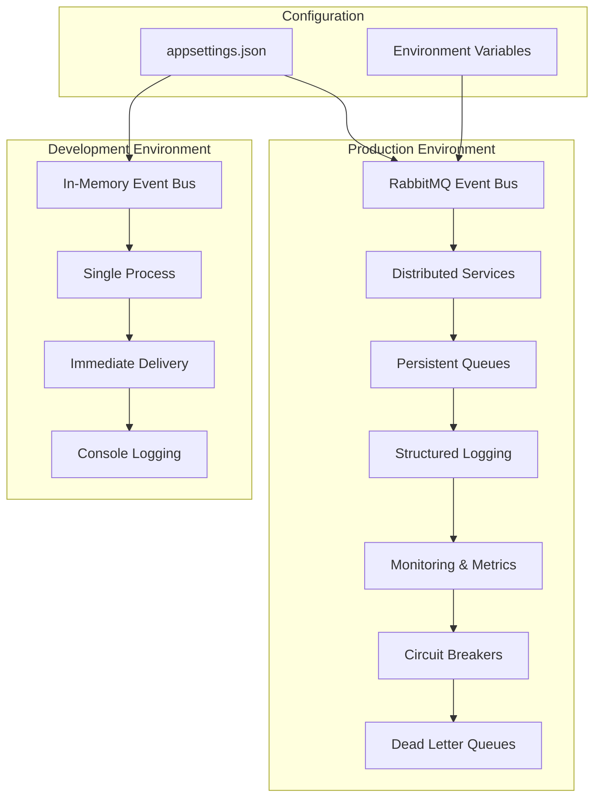

# Integration Bus Architecture Flow

## Overall System Architecture



## Event Publishing Flow



## Class Hierarchy & Dependencies



## Event Subscription & Handling Flow

```mermaid
flowchart TD
    A[Application Startup] --> B[Register Services]
    B --> C[Build Service Provider]
    C --> D[Get IEventBus Instance]
    D --> E[Subscribe to Events]
    
    E --> F{Event Subscription}
    F --> G[eventBus.Subscribe<OrderCreatedEvent, OrderCreatedEventHandler>()]
    F --> H[eventBus.Subscribe<PaymentProcessedEvent, PaymentProcessedEventHandler>()]
    F --> I[eventBus.Subscribe<InventoryUpdatedEvent, InventoryUpdatedEventHandler>()]
    
    G --> J[Add to SubscriptionsManager]
    H --> J
    I --> J
    
    J --> K[Start Message Consumers]
    K --> L[Application Ready]
    
    subgraph "Runtime Event Handling"
        M[Event Published] --> N[Message Broker Receives]
        N --> O[Find Registered Handlers]
        O --> P[Create Service Scope]
        P --> Q[Resolve Handler from DI]
        Q --> R[Invoke Handler.HandleAsync()]
        R --> S[Complete Processing]
    end
    
    L --> M
```

## Dependency Injection Container Flow



## Message Flow Architecture



## Error Handling & Resilience Flow



## Saga Pattern Implementation Flow



## Performance & Scalability Flow



## Development vs Production Flow

